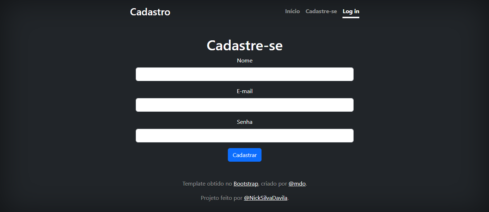
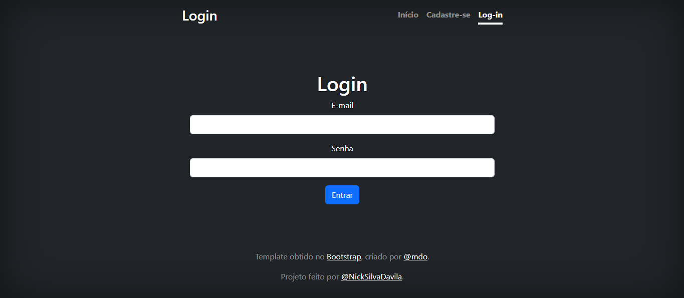

## Aplicar_cadastro_login 

𝐍𝐨𝐰 𝐥𝐨𝐚𝐝𝐢𝐧𝐠...

# Índice🗝️
   - [Aplicar_cadastro_login ](#Aplicar_cadastro_logi%C3%A7%C3%A3o----ATDAV)  
   - [Descrição](#descri%C3%A7%C3%A3o)  
   - [Introdução](#introdu%C3%A7%C3%A3o)  
   - [Funcionalidades](#funcionalidades)
   - [Tecnologias Utilizadas](#tecnologias-utilizadas)  
   - [Fontes Consultadas](#fontes-consultadas)  
   - [Autores](#autores)

.....................................................................................

# Atividade Avaliativa -  ATDAV 🚀

### Descrição

Esta aplicação web meticulosamente desenvolvida oferece uma solução elegante para o gerenciamento de cadastro e login de usuários, utilizando uma combinação harmoniosa de PHP e Bootstrap 5+. O objetivo principal reside em proporcionar uma experiência moderna e responsiva aos usuários, garantindo que novos cadastros sejam realizados sem complicações e que usuários existentes possam acessar a área principal de forma rápida e eficiente. Além disso, o backend da aplicação é habilmente conectado a um banco de dados MySQL, garantindo a integridade e segurança dos dados.

..................................................................................................................................

### Introdução🌟

O conceito por trás deste projeto é simples, mas não menos essencial: fornecer uma plataforma que exemplifique os princípios fundamentais do desenvolvimento web e da integração de sistemas com bancos de dados. Cada componente da aplicação, desde a tela principal até os scripts de processamento de cadastro e login, foi cuidadosamente planejado e implementado para garantir uma experiência coesa e intuitiva para o usuário final.

A aplicação consiste em três páginas principais:

1-Tela Principal (index.php): Página inicial acessível apenas para usuários autenticados.

2-Tela de Login (login.php): Página onde os usuários registrados podem fazer login.

3-Tela de Cadastro (cadastro.php): Página onde novos usuários podem se registrar.

Para a estilização, foi utilizado o modelo "Cover" do Bootstrap 5+, garantindo um design limpo e responsivo.

..............................................................................................................

### Funcionalidades

A estrutura desse projeto reflete essa abordagem organizada e meticulosa, composta por uma série de arquivos, cada um com sua função específica:

>index.php: Este é o ponto de partida da aplicação, a tela principal que dá as boas-vindas aos usuários e os orienta sobre os próximos passos.<

>cadastro.php: Aqui, os novos usuários têm a oportunidade de se registrar, fornecendo informações essenciais como nome, e-mail, senha e tipo de usuário.<

>login.php: Para os usuários já registrados, esta tela oferece um acesso direto à aplicação, onde podem inserir suas credenciais para acessar sua conta.<

>processar_cadastro.php: Um script PHP dedicado ao processamento dos dados fornecidos no formulário de cadastro, garantindo que os novos registros sejam devidamente inseridos na tabela correspondente no banco de dados.<

>processar_login.php: Responsável por validar as credenciais de login fornecidas pelo usuário, este script PHP desempenha um papel crucial na autenticação segura dos usuários.<

>db_connection.php: Para garantir uma comunicação eficiente e segura com o banco de dados MySQL, este script PHP gerencia a conexão e todas as operações relacionadas ao banco de dados.<

>sucesso.php: Uma página de destino especialmente projetada para celebrar um login bem-sucedido, onde os usuários são recebidos com uma mensagem calorosa de boas-vindas.<

Cada elemento desta aplicação, desde sua arquitetura até sua implementação, é uma representação refinada de um processo cuidadoso e deliberado, visando proporcionar uma experiência de usuário excepcionalmente fluida e satisfatória. Com uma ênfase na simplicidade, usabilidade e segurança, este projeto exemplifica os princípios fundamentais do desenvolvimento web moderno.

.................................................................................

 ### Tecnologias Utilizadas🌐

PHP: Linguagem de programação para o backend.

MySQL: Banco de dados para armazenamento das informações dos usuários.

Bootstrap 5+: Framework CSS para estilização e responsividade.

HTML5: Estrutura das páginas web.

CSS3: Estilização adicional.

...............................................................................

 ### Fontes Consultadas🔍

 -[Inteligência Artifcial](https://chat.openai.com/).     
 -[alura](https://www.alura.com.br/artigos/escrever-bom-readme).       
-[Bootstrap](https://getbootstrap.com/docs/5.0/examples/cover/). 
-[Microsoft Bing](https://www.bing.com/chat?q=Microsoft+Copilot&FORM=hpcodx)
-[Guia do PDO](https://www.php.net/manual/en/book.pdo.php)

...............................................................................

 ## Autores💮
 [Nicolly da Silva Davila 3'A](https://github.com/NickSilvaDavila)
